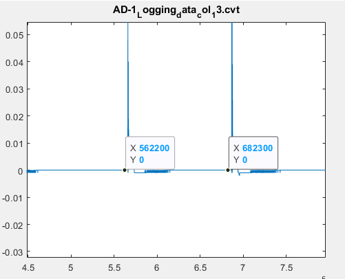

# BMI Vibration Analysis

### Requirements
* ADLink-2405 (Data Acquisition module)
* DAQCvt applicaition (download package [here](https://www.adlinktech.com/Products/DownloadSoftware?lang=en&pdNo=1297&MainCategory=Data_Acquisition&kind=DR))
* Accelerometers
* MATLAB 2018a (or later)

##Determine the damping ratio
A step-by-step guide on how to obtain the damping ratios of the samples tested.

### Prerequisite
Download the MIR toolbox [here](https://www.jyu.fi/hytk/fi/laitokset/mutku/en/research/materials/mirtoolbox).

### 1. Edit include.m

> dataset_dir = 'folder/containing/audiodata'

> toolboxes_dir = 'path/to/MIRToolbox'

> results_dir = 'path/to/results'

> daqcvt_program = 'path/to/Utility/UD-DASK_DAQCvt.exe'

### 2. Run extract_vibrations.m
In the MATLAB _Command Window_, enter the following:

> ->>`extract_vibrations`

#### I. The UD-DASK File Convert Utility will appear same as below.
<dl>
 

  

</dl>

#### _STEPS_
1. **Browse** the _.dat_ file that you want to convert. (Repeat for all files)
2. **Load** the data in the application. Details should appear on the application.
3. Click **Start COnvert** to create the _.cvt_ file.
4. **Exit** the application to continue the script.

#### II. Select the folder where the _.dat_ and _.cvt_ files are located
The program extracts the vibration data and the modal parameters of the test samples. These are stored in _results_dir_.

#### HANDLING ERROR: If the tester did not executed the number of repetitions correctly, you could select the starts of the data.

The script will plot the time-domain signal of each column and the startt ime of each impulse should be selected properly.

1. Select the starts by clicking on the start points of each impulse

- Use the _Data Selector_ tool to select the data points. Default is five (5) points.

<dl>
 

  

</dl>

2. Export the data

- Right click on the figure and select _Export Data to workspace_ and name the variable as **s**.

<dl>
 

  

</dl>

#### III. Loading the results
The results (.mat files) are saved in the _results_dir_. 
You can navigate to that directory and 
> **Double-click** the _.mat_ file. 

To load the natural frequencies and damping ratio

> **Double-click** again the `modalparams_t` variable in the _Workspace_ to view a table format of the data.
